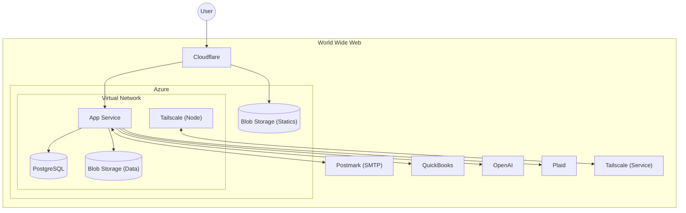

# Security Policy

## Reporting a Security Issue

Email chris@supplyside.io with any security risks or concerns.

## Corporate device policy

Employees use their personal devices. Employees are responsible for ensuring Automatic Updates are enabled on their OS and responsible for ensuring the updates apply the day they are released.

## Infrastructure

### Topology

### Cloud Security strategy

All assets are deployed to PaaS, so that our cloud provider is liable for most infrastructure security considerations. Compute resources should use ephemeral compute, both to minimize our vulnerability surface and minimize impact of rebuilding infrastructure. All customer data is stored at rest within our private virtual network without network access to the internet. Resources in our virtual network are administered either via Azure Portal or with access to Tailscale. 

Our Tailscale node is hosted on an Azure VM within our private virtual network. Tailscale's firewall rejects all traffic except to port 41641, as required by Tailscale. The VM is configured for daily security updates.

### Authorizing access to Critical Systems

Microsoft Entra is our primary IAM provider. Microsoft Entra requires MFA for all signins.

* GitHub
* Azure (via Entra)
* Tailscale (via Entra)

Our private network (database, blob storage) is accessible via Tailscale.

Contractors must not be granted access to critical systems.

### Auditing access to Critical Systems

Tailscale logs all logins and active sessions.

